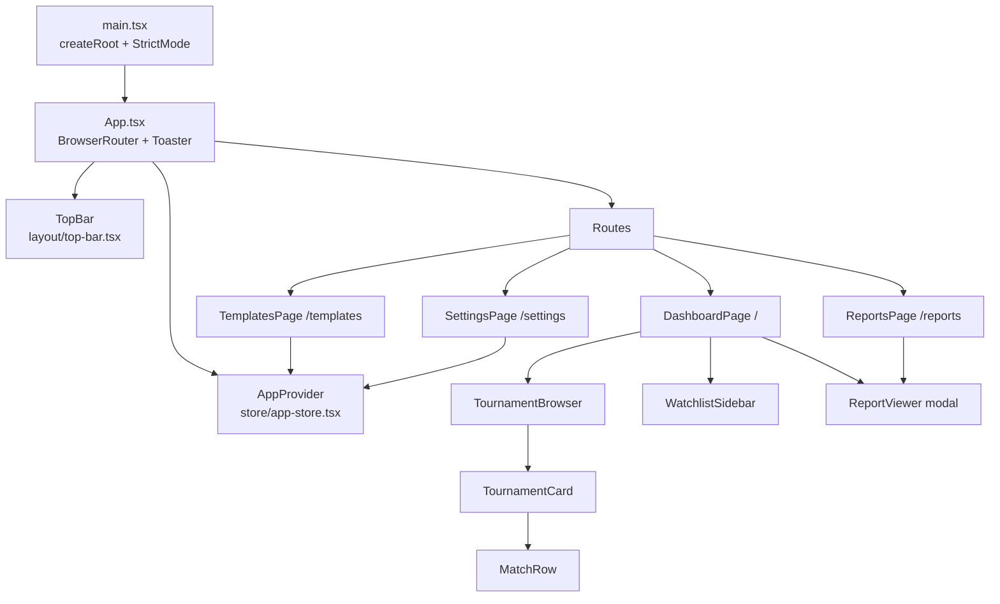
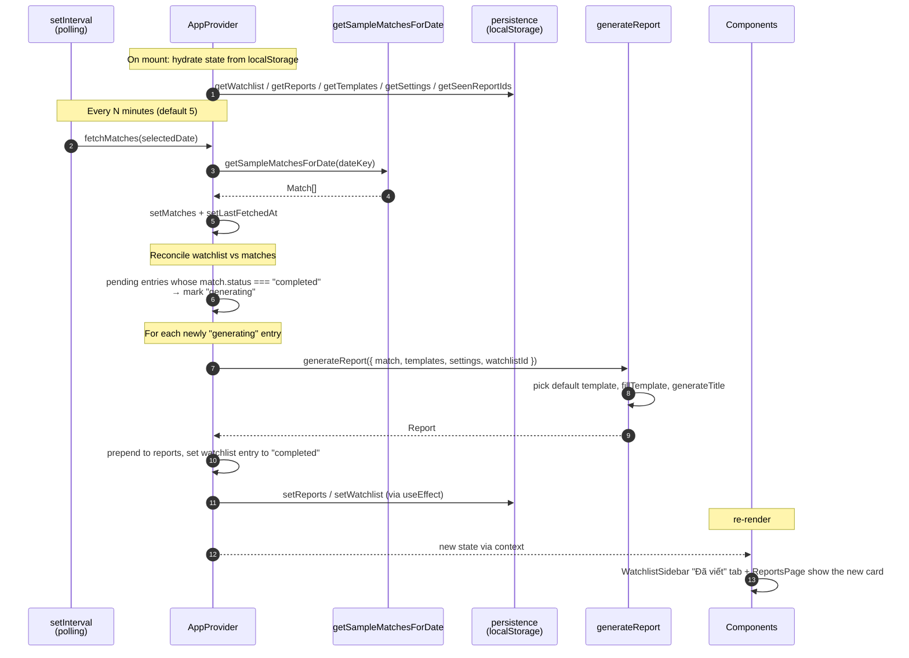
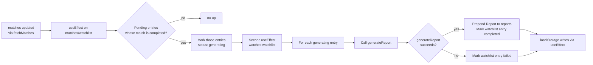

# System Architecture — Tennis Report Hub

> How the modules fit together at runtime, and how a tennis match becomes a Vietnamese recap.

## 1. The 10-second mental model

The app is a single SPA. Everything is a React tree under one `AppProvider`. The provider owns five state slices (matches, watchlist, reports, templates, settings + derived). On a timer it asks `getSampleMatchesForDate()` (today: a fixture list) for the latest data, reconciles that with the watchlist, and — when a watched match just became `completed` — calls `generateReport()` and pushes the result onto the report stack. `localStorage` is the only persistence; the `store/persistence.ts` module is shaped so it can be swapped for Supabase later without touching call sites.

## 2. Component tree



## 3. Data flow — the lifecycle of a report



## 4. Module responsibilities

| Module                          | Responsibility                                                                 |
| ------------------------------- | ------------------------------------------------------------------------------ |
| `main.tsx`                      | React root, StrictMode, mount `App`                                            |
| `App.tsx`                       | Router, `AppProvider`, `TopBar`, `Toaster`                                     |
| `store/app-store.tsx`           | State, persistence triggers, polling, match → report orchestration           |
| `store/persistence.ts`          | `localStorage` adapter — read/write with safe defaults; the future Supabase seam |
| `reports/generate.ts`           | Title generation, narrative engine, template fill                              |
| `reports/templates.ts`          | Three default templates (Mặc định / Ngắn gọn / Kịch tính)                     |
| `data/sample-data.ts`           | 26 players, 3 tournaments, 13 matches — the v1 data source                     |
| `lib/utils.ts`                  | `cn`, `uid`, `formatDateKey`, `parseDateKey`, `timeAgo`, `formatTime`, `formatDateVi`, `formatDateShort` |
| `lib/format-helpers.ts`         | `formatFinalScore` (currently used by `ReportsPage`; `generate.ts` has its own) |
| `components/layout/top-bar.tsx` | Sports selector + date stepper + refresh + nav                                 |
| `components/dashboard/...`      | Tournament grouping, expand/collapse, match rows with star toggle              |
| `components/watchlist/...`      | Two-tab sidebar (Đang chờ / Đ�ã viết)                                          |
| `components/reports/report-viewer.tsx` | Modal: read / edit / copy report                                        |
| `components/ui/...`             | 13 shadcn-style primitives                                                      |
| `pages/...`                     | Route entry points, mostly compose the above                                   |

## 5. State slices — what lives where

| Slice             | Type                | Persisted? | Updated by                                                          |
| ----------------- | ------------------- | ---------- | ------------------------------------------------------------------- |
| `selectedDate`    | `string` (YYYY-MM-DD) | no       | `setSelectedDate` from `TopBar`                                     |
| `matches`         | `Match[]`           | no         | `fetchMatches` (every poll + initial + manual refresh)              |
| `isFetchingMatches` | `boolean`         | no         | `fetchMatches` lifecycle                                            |
| `matchError`      | `string \| null`    | no         | `fetchMatches` failure path                                         |
| `lastFetchedAt`   | `Date \| null`      | no         | `fetchMatches` success path                                         |
| `watchlist`       | `WatchlistEntry[]`  | yes (`trh:watchlist`) | `toggleWatchlist`, `removeFromWatchlist`, polling reconciliation |
| `reports`         | `Report[]`          | yes (`trh:reports`)   | `generateReport` (auto), `updateReport`, `markReportSeen`           |
| `templates`       | `ReportTemplate[]`  | yes (`trh:templates`) | `addTemplate`, `updateTemplate`, `deleteTemplate`, `setDefaultTemplate` |
| `settings`        | `Settings`          | yes (`trh:settings`)  | `updateSettings`                                                    |
| `seenReportIds`   | `string[]`          | yes (`trh:seenReports`) | `markReportSeen`                                                 |

Derived (not stored): `isWatchlisted(matchId)`, `getReportByMatch(matchId)`, `newReports = reports.filter(r => r.isNew)`.

## 6. The "match just completed" pipeline in detail

This is the only multi-step internal flow; the rest are trivial updates.



Why two effects? The first is the **state transition** (pending → generating) and the second is the **side effect** (running `generateReport`). Keeping them separate means `generateReport` never runs on a stale match list — it always runs against the watchlist after the transition has settled.

## 7. The narrative engine

`reports/generate.ts` is deterministic. No LLM. Given the same match, the same default template, and the same stats, the same Vietnamese text comes out.

Pipeline:

1. `getMatchWinner(match)` — count sets won by each player, return `1` / `2` / `null`.
2. `fillTemplate(template.content, match, winner)` — substitute ~30 placeholders. Three placeholders are themselves derived text:
   - `{setNarrative}` — set-by-set Vietnamese recap built by `buildSetNarrative`
   - `{momentumNote}` — Vietnamese phrase chosen by number of set-to-set momentum swings (`buildMomentumNote`)
   - `{contextNote}` — ranking-aware context line (`buildContextNote`)
3. `generateTitle(match, winner)` — produces a Vietnamese title that depends on whether the match went to 3 sets and whether the winner came from behind.

The placeholders catalogue (lives in `fillTemplate`):

```
{tournament} {round} {surface} {surfaceLabel}
{player1} {player1Full} {flag1} {rank1} {seedText1}
{player2} {player2Full} {flag2} {rank2} {seedText2}
{winner} {winnerFull} {loser} {loserFull} {winnerRank} {loserRank}
{score} {setScores}
{setNarrative} {momentumNote} {contextNote} {turningPoint}
{duration}
{acesWinner} {acesLoser} {acesRatio}
{firstServePct} {firstServePctLoser}
{bpConverted} {bpFaced}
```

## 8. Routing

```
/            → DashboardPage     (2-col grid: browser + sidebar)
/reports     → ReportsPage       (searchable / sortable report history)
/templates   → TemplatesPage     (template CRUD + set default)
/settings    → SettingsPage      (API key, polling, TZ, notifications)
```

`NavLink` is used in the top bar so the active route gets `bg-slate-800 text-slate-100`. No nested routes, no route params.

## 9. Network surface

v1: **zero outbound calls.** `fetchMatches` simulates a 600ms latency and returns `getSampleMatchesForDate(dateKey)`. The `Settings.rapidApiKey` field exists for v2 wiring; nothing reads it yet.

When the real integration lands (v2), the seam is:

```ts
// store/app-store.tsx
const fetchMatches = useCallback(async (dateKey: string) => {
  setIsFetchingMatches(true);
  setMatchError(null);
  try {
    await new Promise((r) => setTimeout(r, 600));   // remove
    const data = getSampleMatchesForDate(dateKey);   // replace with real fetch
    setMatches(data);
    setLastFetchedAt(new Date());
  } catch (e) { ... }
  finally { ... }
}, []);
```

## 10. Build-time vs runtime

- **Build-time**: TypeScript type-check (`tsc -b`), Vite bundle (HTML + JS + CSS in `dist/`).
- **Runtime**: Everything runs in the browser. The Vite dev server (`npm run dev`) serves modules on-demand with HMR. Production builds produce a static `dist/` that can be served by any static host.

There is no SSR, no edge function, no service worker.

## 11. Failure modes & safety nets

| Failure                                     | Current behavior                                                |
| ------------------------------------------- | --------------------------------------------------------------- |
| `localStorage` quota exceeded               | `write()` swallows the error; state in memory stays correct     |
| `localStorage` value corrupted (bad JSON)   | `read<T>()` returns the fallback; user sees a fresh state       |
| `generateReport` throws                      | The `try/catch` in the report-generation effect marks the entry `failed`; UI shows the failed status badge |
| `fetchMatches` rejects                      | `matchError` set, error banner shown in `TopBar`, dashboard shows retry card |
| User clears `localStorage` from devtools   | Templates re-seed from `DEFAULT_TEMPLATES` on next load         |
| No internet (v1)                            | App is fully offline; nothing to fetch anyway                   |

## 12. Performance budget

- Initial JS (gzipped): currently ≈ 200 KB (estimate; measure with `npm run build` output)
- Initial paint of dashboard: < 1.5 s on a fresh load (local)
- Re-render on a new report: 1 context-value change → all consumers re-render; reduce by memoizing heavy children (already done for `TournamentBrowser`'s `groups` and `ReportsPage`'s `filtered`)

## 13. See also

- `code-standards.md` — coding rules
- `codebase-summary.md` — what's in the repo
- `project-roadmap.md` — where this is going (including the Supabase migration)
